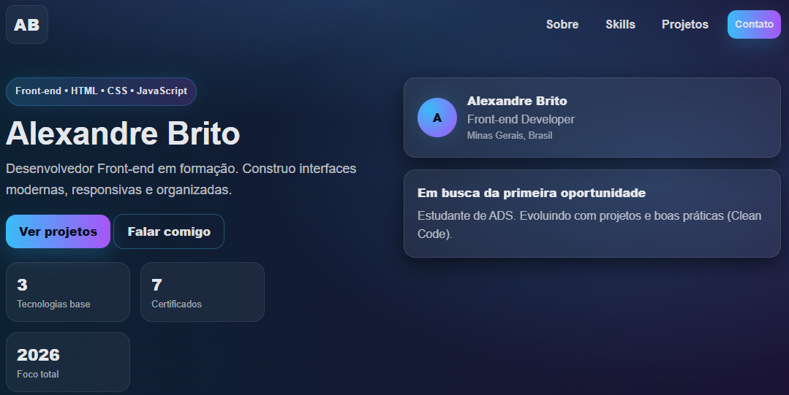

# 💻 Meu Portfólio Front-end

Meu primeiro projeto de portfólio desenvolvido com **HTML, CSS e JavaScript**.

Este projeto foi criado como parte dos meus estudos em **Desenvolvimento Front-end**, com o objetivo de praticar estrutura de páginas web, estilização moderna e interatividade com JavaScript.

---

## 🚀 Acesse o Projeto

🔗 Em breve online pelo GitHub Pages

---

## 🖼️ Preview do Projeto

---

## 🛠️ Tecnologias Utilizadas

- HTML5
- CSS3
- JavaScript

---

## ✨ Funcionalidades

- Layout moderno estilo Tech/Neon
- Design responsivo (Mobile e Desktop)
- Menu responsivo (hambúrguer)
- Seções organizadas
- Skills interativas
- Botão copiar email
- Formulário simulado
- Navegação suave
- Miniatura de projetos

---

## 📁 Estrutura do Projeto
# 💻 Meu Portfólio Front-end

Meu primeiro projeto de portfólio desenvolvido com **HTML, CSS e JavaScript**.

Este projeto foi criado como parte dos meus estudos em **Desenvolvimento Front-end**, com o objetivo de praticar estrutura de páginas web, estilização moderna e interatividade com JavaScript.

---

## 🚀 Acesse o Projeto

🔗 Em breve online pelo GitHub Pages

---

## 🖼️ Preview do Projeto

---

## 🛠️ Tecnologias Utilizadas

- HTML5
- CSS3
- JavaScript

---

## ✨ Funcionalidades

- Layout moderno estilo Tech/Neon
- Design responsivo (Mobile e Desktop)
- Menu responsivo (hambúrguer)
- Seções organizadas
- Skills interativas
- Botão copiar email
- Formulário simulado
- Navegação suave
- Miniatura de projetos

---

## 📁 Estrutura do Projeto

# 💻 Meu Portfólio Front-end

Meu primeiro projeto de portfólio desenvolvido com **HTML, CSS e JavaScript**.

Este projeto foi criado como parte dos meus estudos em **Desenvolvimento Front-end**, com o objetivo de praticar estrutura de páginas web, estilização moderna e interatividade com JavaScript.

---

## 🚀 Acesse o Projeto

🔗 Em breve online pelo GitHub Pages

---

## 🖼️ Preview do Projeto

---

## 🛠️ Tecnologias Utilizadas

- HTML5
- CSS3
- JavaScript

---

## ✨ Funcionalidades

- Layout moderno estilo Tech/Neon
- Design responsivo (Mobile e Desktop)
- Menu responsivo (hambúrguer)
- Seções organizadas
- Skills interativas
- Botão copiar email
- Formulário simulado
- Navegação suave
- Miniatura de projetos

---

## 📁 Estrutura do Projeto

---

## 🎯 Objetivo

Este projeto faz parte da minha evolução como **Desenvolvedor Front-end**, onde estou focado em aprender:

- HTML
- CSS
- JavaScript
- Boas práticas de código
- Layout responsivo

---

## 👨‍💻 Autor

**Alexandre Brito**

Desenvolvedor Front-end em formação.

🔗 LinkedIn:  
https://linkedin.com/in/alexandre-brito-b6a7071b2/

🔗 GitHub:  
https://github.com/AlexandreBrito26

---

## 📚 Próximos Projetos

- Calculadora JavaScript
- To-do List
- Landing Page
- Projetos com API
- React (futuro)

---

## ⭐ Status do Projeto

🚧 Em desenvolvimento

Projeto em constante evolução.
